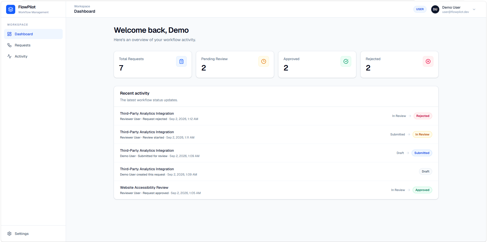
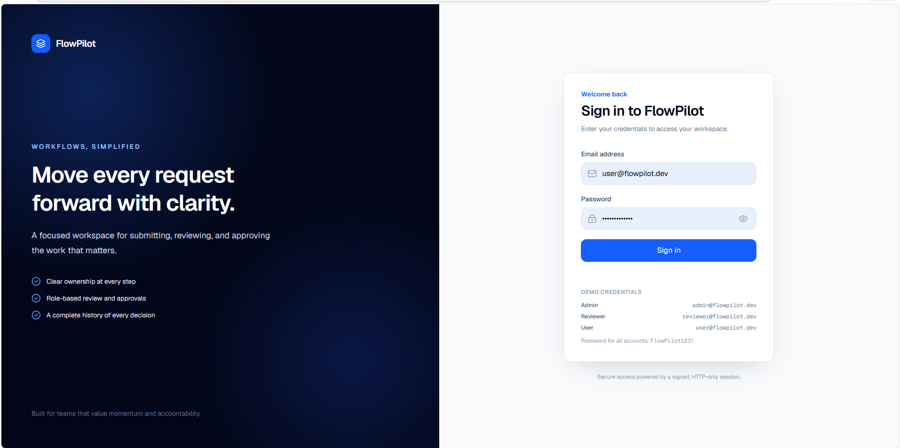
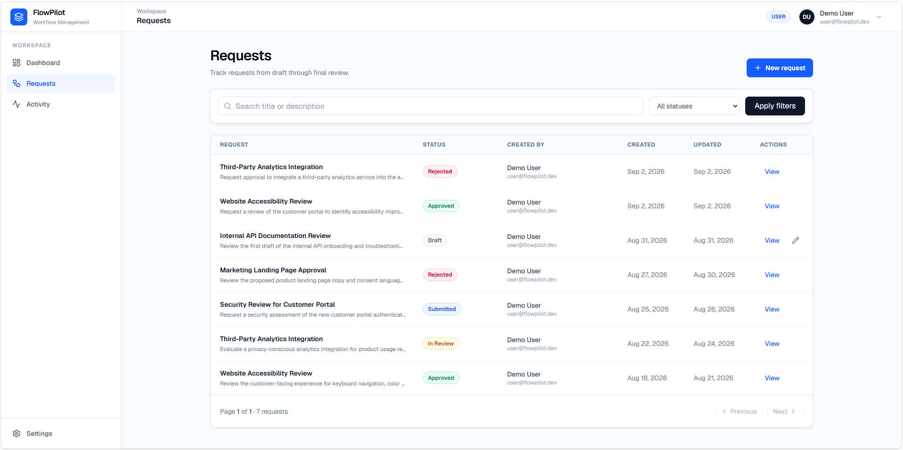
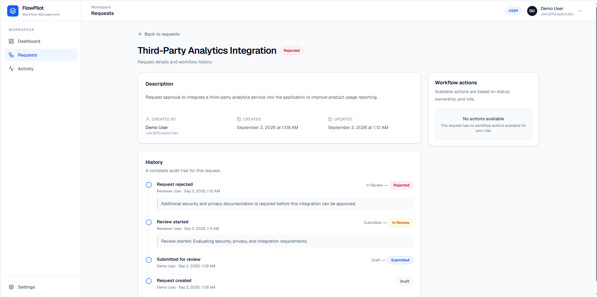
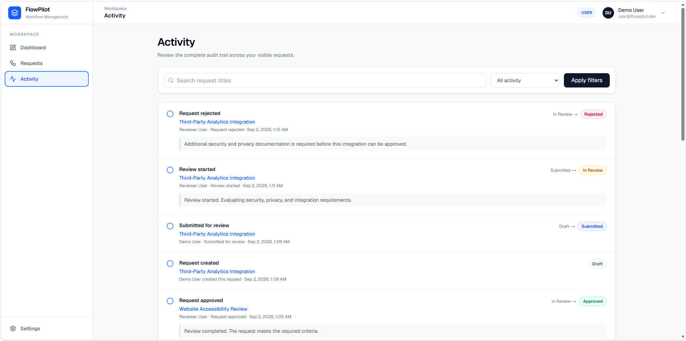
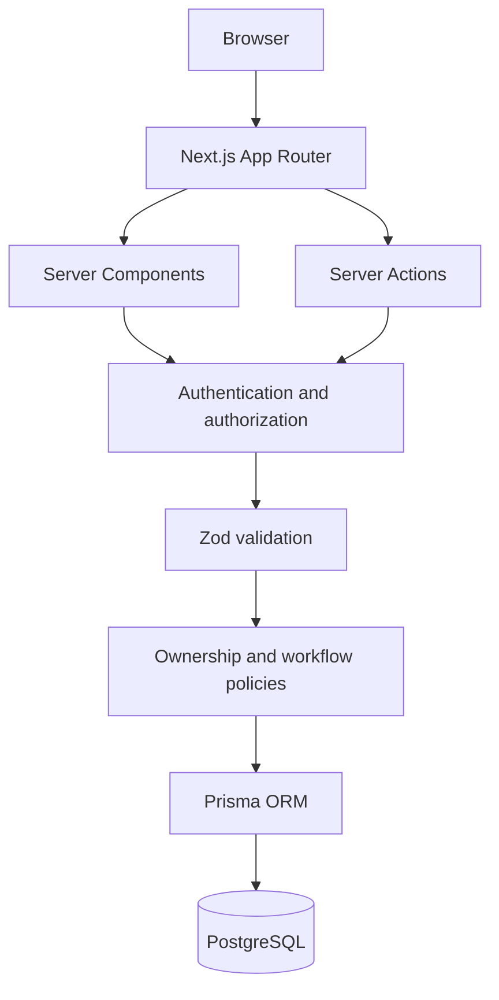

# FlowPilot

FlowPilot is a full-stack workflow management platform demonstrating secure authentication, role-based authorization, transactional workflow state management, audit history, and modern SaaS architecture.

## Overview

FlowPilot models a common operational problem: a request begins as a draft, moves through a controlled review process, and finishes with an auditable decision. The project focuses on the engineering behind that workflow—server-enforced ownership, hierarchical permissions, concurrency-aware transitions, and a responsive interface—rather than domain-specific business data.



## Live Demo

Production URL: _Coming soon._

## Screenshots

### Login



### Requests



### Request Detail & Audit Trail



### Activity



## Demo Accounts

These credentials are intended for local and public demo environments only.

| Role | Email | Password |
| --- | --- | --- |
| ADMIN | `admin@flowpilot.dev` | `FlowPilot123!` |
| REVIEWER | `reviewer@flowpilot.dev` | `FlowPilot123!` |
| USER | `user@flowpilot.dev` | `FlowPilot123!` |

## Core Features

- Secure email and password authentication
- Signed, expiring HTTP-only sessions
- Hierarchical USER, REVIEWER, and ADMIN authorization
- Role-scoped dashboard metrics and activity
- Request creation, ownership, and draft editing
- Server-side search, status filtering, and pagination
- Server-authoritative workflow state transitions
- Transactional request history and audit trails
- Searchable, filterable, role-scoped Activity page
- Responsive dashboard, tables, mobile lists, and navigation
- Zod validation on authentication and request mutations
- Automated Vitest coverage of core business rules

## Workflow

```text
DRAFT
  │  creator submits
  ▼
SUBMITTED
  │  REVIEWER or ADMIN starts review
  ▼
IN_REVIEW
  ├── REVIEWER or ADMIN ──► APPROVED
  └── REVIEWER or ADMIN ──► REJECTED
```

Only the request creator may submit a draft. REVIEWER and ADMIN accounts can start and decide reviews, but do not gain permission to edit another user's request content. Rejection requires a reason.

## Roles and Permissions

| Capability | USER | REVIEWER | ADMIN |
| --- | :---: | :---: | :---: |
| Create a request | Yes | Yes | Yes |
| View own requests | Yes | Yes | Yes |
| View all requests and activity | No | Yes | Yes |
| Edit own draft | Yes | Yes | Yes |
| Edit another user's content | No | No | No |
| Submit own draft | Yes | Yes | Yes |
| Start, approve, or reject a review | No | Yes | Yes |
| Access the protected Users placeholder | No | No | Yes |

Authorization is hierarchical: `ADMIN >= REVIEWER >= USER`.

## Architecture



- Server Components authenticate users and query role-scoped data directly.
- Server Actions handle login, request creation, editing, and workflow transitions.
- Zod validates all user-controlled mutation and query input.
- Pure policy modules define role levels, ownership, editing, and valid transitions.
- Prisma transactions atomically update workflow state and append audit history.
- Search, filtering, and pagination use shareable URL parameters and database queries.
- Client Components are limited to interactive behavior such as forms, menus, and mobile navigation.

## Security Decisions

- Sessions are JWTs signed with `jose` and stored in an HTTP-only cookie.
- The session cookie uses `SameSite=Lax` and enables `Secure` in production.
- JWT verification restricts the algorithm to HS256 and validates issuer and audience.
- Session payloads contain only the user ID and role and expire after seven days.
- Passwords are hashed with `bcryptjs`; hashes are never returned to Client Components.
- Invalid login attempts use a generic error that does not disclose account existence.
- Authentication tokens are never stored in `localStorage`.
- Roles, ownership, creator IDs, and request status are revalidated on the server.
- USER database queries are scoped to requests they created.
- Workflow mutations re-read current state and use conditional updates inside transactions to reject stale transitions.

## Tech Stack

| Area | Technologies |
| --- | --- |
| Frontend | Next.js 16 App Router, React 19, TypeScript, Tailwind CSS, Lucide React |
| Forms and validation | React `useActionState`, Zod |
| Backend | Next.js Server Components and Server Actions |
| Data | Prisma 7, PostgreSQL, Prisma PostgreSQL driver adapter |
| Security | `jose`, `bcryptjs` |
| Infrastructure | Docker Compose for local PostgreSQL |
| Testing | Vitest |

## Database Model

- **User** stores identity, password hash, and role. Users create requests and perform audited actions.
- **Request** stores owned workflow content and its current status.
- **RequestHistory** records request creation and every status transition, including actor, previous status, next status, optional comment, and timestamp.

`RequestHistory.fromStatus` is nullable so the initial `null -> DRAFT` creation event is represented consistently.

## Testing

```bash
npm run test
npm run lint
npm run build
```

The unit suite covers:

- The complete hierarchical RBAC matrix
- Request visibility and draft-edit ownership
- Valid, invalid, stale, and terminal workflow transitions
- Request and workflow-comment validation
- Shared audit-activity presentation

The current suite contains **51 tests**.

## Local Development

Requirements: Node.js, npm, Docker with Compose support, and Git.

1. Clone and enter the repository:

   ```bash
   git clone https://github.com/DavidMA1897/workflow-hub.git
   cd workflow-hub
   ```

2. Install dependencies:

   ```bash
   npm install
   ```

3. Create the local environment file:

   ```bash
   cp .env.example .env
   ```

   On Windows PowerShell:

   ```powershell
   Copy-Item .env.example .env
   ```

4. Replace the example database password and generate a session secret:

   ```bash
   openssl rand -base64 32
   ```

5. Start PostgreSQL:

   ```bash
   docker compose up -d
   ```

6. Apply the existing migrations:

   ```bash
   npx prisma migrate deploy --config prisma7.config.ts
   ```

7. Generate Prisma Client:

   ```bash
   npx prisma generate --config prisma7.config.ts
   ```

8. Seed demo users, requests, and audit history:

   ```bash
   npx prisma db seed --config prisma7.config.ts
   ```

9. Start the application:

   ```bash
   npm run dev
   ```

Open [http://localhost:3000](http://localhost:3000).

## Environment Variables

| Variable | Purpose |
| --- | --- |
| `POSTGRES_USER` | Local Docker PostgreSQL user |
| `POSTGRES_PASSWORD` | Local Docker PostgreSQL password |
| `POSTGRES_DB` | Local Docker PostgreSQL database name |
| `DATABASE_URL` | PostgreSQL connection string used by Prisma and the application |
| `SESSION_SECRET` | Random secret of at least 32 characters used to sign sessions |

Never commit `.env` or production credentials. Use the deployment platform's encrypted environment-variable configuration in production.

## Useful Commands

| Command | Purpose |
| --- | --- |
| `npm run dev` | Start the development server |
| `npm run test` | Run the unit test suite once |
| `npm run test:watch` | Run tests in watch mode |
| `npm run lint` | Run ESLint |
| `npm run build` | Create a production build |
| `docker compose up -d` | Start local PostgreSQL |
| `docker compose down` | Stop local PostgreSQL without deleting its volume |
| `npx prisma generate --config prisma7.config.ts` | Generate Prisma Client |
| `npx prisma migrate deploy --config prisma7.config.ts` | Apply committed migrations |
| `npx prisma db seed --config prisma7.config.ts` | Seed deterministic demo data |
| `npx prisma studio --config prisma7.config.ts` | Open Prisma Studio |

## Project Structure

```text
app/
├── (dashboard)/       # Protected dashboard, requests, activity, and placeholders
├── actions/           # Authentication and request Server Actions
├── login/             # Public login route
└── layout.tsx         # Root metadata and document layout
components/
├── activity/          # Activity filters, list, and pagination
├── auth/              # Login form
├── dashboard/         # Metrics and recent activity
├── layout/            # Responsive application shell
└── requests/          # Request forms, lists, workflow actions, and history
lib/
├── activity/          # Activity queries and presentation rules
├── auth/              # Session, authentication, and role policies
├── dashboard/         # Dashboard data queries
└── requests/          # Access, query, and workflow services
prisma/
├── migrations/        # Versioned database migration history
├── schema.prisma      # Relational data model
└── seed.ts            # Deterministic demo data
tests/                 # Business-rule unit tests
validations/           # Shared Zod schemas
```

## Technical Decisions

- **HTTP-only cookie sessions:** keeps authentication tokens unavailable to browser JavaScript.
- **Server-side authorization:** every protected query and mutation verifies identity, role, and ownership at execution time.
- **Policy/persistence separation:** pure workflow and access policies can be tested without a database.
- **Transactional audit history:** status updates and history records succeed or fail together.
- **URL-driven list state:** search, filters, and page selection survive refresh and can be shared.
- **Server Components for data views:** avoids client-side database-fetch waterfalls and keeps Prisma server-only.
- **Pure policy tests:** business behavior is verified without modifying a developer database.

## Deployment

FlowPilot requires a Node.js runtime and a PostgreSQL database; it cannot be deployed as a static export. A deployment must provide `DATABASE_URL` and a strong `SESSION_SECRET`, install dependencies, generate Prisma Client, apply committed migrations, and run the Next.js production build.

Vercel is a suitable deployment target for this Next.js application, but FlowPilot is not currently documented as deployed. Any Node.js host that supports the App Router, Server Actions, and access to PostgreSQL can also run the application.

A typical release sequence is:

```bash
npm install
npx prisma generate --config prisma7.config.ts
npx prisma migrate deploy --config prisma7.config.ts
npm run build
npm run start
```

Set production secrets through the hosting provider rather than committing environment files. Run migrations as a controlled release step before serving the new application version.

## Future Improvements

- Isolated PostgreSQL integration tests
- Login rate limiting and progressive throttling
- Database-backed session revocation
- AWS S3 document attachments
- In-app and email notifications
- CI/CD quality and deployment pipelines
- Richer user-administration workflows

## License

Released under the [MIT License](LICENSE).
